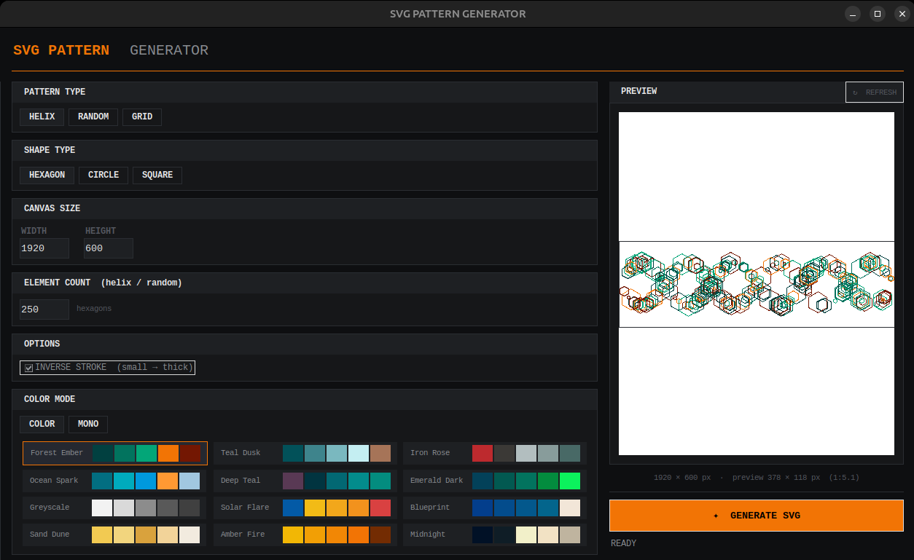

# SVG Pattern Generator

A desktop tool for generating SVG patterns of hexagons, circles, and squares — with a live preview, multiple palettes, and flexible layout modes.

  

---

## Features

- **3 pattern types** — Helix, Random scatter, Honeycomb grid
- **3 shape types** — Hexagon, Circle, Square
- **12 color palettes** + monochrome mode
- **Live preview** — scaled to canvas aspect ratio with white background
- **Save dialog** — choose your output path at generation time
- **Input validation** — clamped hex size, minimum count enforcement
- Pure Python — no external dependencies beyond the standard library

## Screenshot



## Requirements

- Python 3.8 or newer
- `tkinter` (included with standard Python on Windows and macOS)

On Linux, install tkinter if missing:
```bash
sudo apt install python3-tk      # Debian/Ubuntu
sudo dnf install python3-tkinter # Fedora
```

## Installation

```bash
git clone https://github.com/anandhusjone/SVG-Pattern-Generator.git
cd SVG-Pattern-Generator
python pattern_gen_v1.0.py
```

No `pip install` needed — zero external dependencies.

## Usage

1. Select a **Pattern Type** (Helix / Random / Grid)
2. Select a **Shape Type** (Hexagon / Circle / Square)
3. Set the **Canvas Size** in pixels
4. Adjust count or grid size depending on pattern mode
5. Pick a **Color Palette** or switch to Monochrome
6. Click **↻ REFRESH** on the right panel to preview
7. Click **✦ GENERATE SVG** — choose where to save

## Output

Generates a standard `.svg` file at the dimensions you specified, viewable in any browser or vector editor (Inkscape, Illustrator, Figma, etc.).

## License

MIT — do whatever you want with it.
